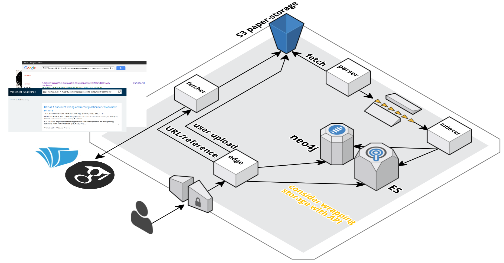

= paper reader
Service to store whitepaper reading progress and reference

== Overview
https://cloudcraft.co/view/084a7d3d-bd8d-4473-8921-36f8eafe3b4c?key=mBoLig8ca6q-PKYfAQAKAw&embed=true

=== TODO
- [x] parse document
- [x] fetch documents from S3
- [ ] store to neo4j reflecting reference hierarchy
- [ ] consider wrapping storage with APIs
- [ ] consider switching to messaging
- [ ] store to elasticsearch for full text search
- [ ] UI to view papers
- [ ] UI to upload
- [ ] fetcher service
- [ ] UI to trigger reference fetch