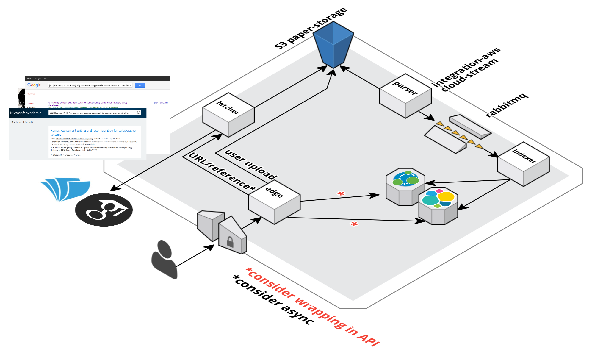

= paper reader
Service to store whitepaper reading progress and reference

== Overview
https://cloudcraft.co/view/084a7d3d-bd8d-4473-8921-36f8eafe3b4c?key=mBoLig8ca6q-PKYfAQAKAw&embed=true

=== TODO
- [ ] consider wrapping storage with APIs

==== parser
- [x] parse document
- [x] fetch documents from S3
- [x] get rid of newlines
- [ ] use ML instead of parser logic with gazillion rules

==== fetcher
- [ ] fetcher service

==== UI edge gateway
- [ ] UI to view papers
- [ ] UI to upload
- [ ] UI to trigger reference fetch
- [ ] consider switching to messaging for fetcher calls
- [ ] SSE for dynamic updates